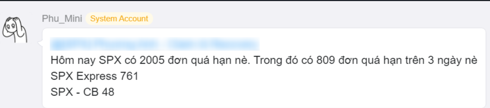

A bot was created using Google Apps Script to send automated alerts when backlog orders exceed a defined threshold. The script checks values from a Google Sheet, generates a warning message if the total overdue orders surpass the limit, and highlights orders overdue for more than 3 days. It then posts the content, including specific breakdowns (e.g., SPX Express, SPX - CB), to a Seatalk group via webhook.

Result:
The message was successfully posted to Seatalk, tagging the relevant person and including detailed breakdowns.

Tech used:
Google Apps Script
Webhook API
Google Sheets data input
